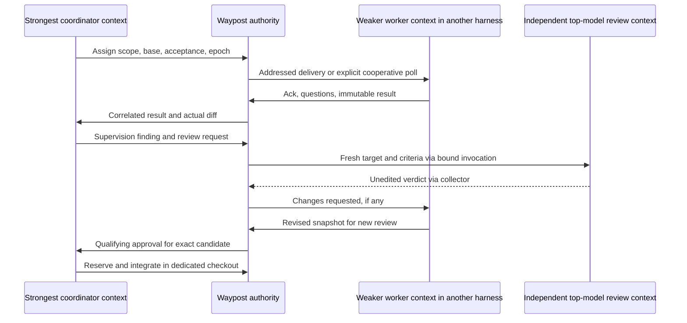

# WP-20: One task coordinated across harnesses and AI models

| Field | Value |
|---|---|
| Status | planned epic; first story in progress, implementation incomplete |
| Priority | p1 |
| Created / Updated | 2026-09-30 |

## Goal

Enrolled sessions in different harnesses and models collaborate on one task.
The strongest eligible model coordinates and checks actual results; independent
fresh contexts at the strongest review-model priority critique the exact target.
Ownership, messages, handover and integration are auditable and recoverable.

The owner selected architecture and tasks first, and specifically observed
Claude/OpenCode sessions cannot communicate. Actual addressed message exchange
between their contexts, in both directions, is a first-release acceptance item.
Implementation started after the owner authorized it. Model selection, authority
logging and cooperative inbox foundations are present; live native messaging and
reviewed Git integration are not yet verified.

## Context

Existing presence/claims/leases are advisory conflict detection. They cannot
safely elect a distributed scheduler. There is no model identity, mailbox,
assignment or review ledger, and role invoke strings are not native APIs.

Proposed boundaries: one host-local authority; separate participant identities;
automatically refreshed exact-model evidence policy; acknowledged stronger-model handover;
cooperative messages plus evidenced native adapters; isolated edits, immutable
results and independent top-model review; exact reviewed Git integration.

## Stories

The first story is in progress; the other eight remain planned. No story is
closed. A fresh planner supplied the initial implementation plan.

| Story | Depends on |
|---|---|
| [Participant identity and automatic model strength discovery](stories/story-participant-identity-and-owner-approved-model-policy.md) | Owner approval / spec activation |
| [Local authority log and crash-safe mutations](stories/story-local-authority-log-and-crash-safe-mutations.md) | 1 |
| [Addressed messages and verified harness delivery](stories/story-addressed-messages-and-verified-harness-delivery.md) | 2 |
| [Assignments supervision and stronger-model handover](stories/story-assignments-supervision-and-stronger-model-handover.md) | 1, 2, 3 |
| [Independent strongest-model review of immutable evidence](stories/story-independent-strongest-model-review-of-immutable-evidence.md) | 1, 3, 4 |
| [Reviewed integration and team-aware story gates](stories/story-reviewed-integration-and-team-aware-story-gates.md) | 2, 4, 5 |
| [Team CLI orientation and deterministic diagnostics](stories/story-team-cli-orientation-and-deterministic-diagnostics.md) | 2, 3, 4, 5, 6 |
| [Automatic model routing by task complexity and expected cost](stories/story-automatic-model-routing-by-task-complexity-and-expected-cost.md) | 1, 2, 4, 5, 6 |
| [Live Claude, Codex and OpenCode coordination on one task](stories/story-live-claude-and-opencode-coordination-on-one-task.md) | 1, 2, 3, 4, 5, 6, 7, 8 |

## Expected Results

- [ ] Strongest qualified participant automatically leads after policy/enrollment.
- [ ] Bounded simple tasks use economical qualified executors; complex tasks use
      strongest execution models, with independent strongest review and cost limits.
- [ ] One accepted scheduling history despite concurrent requests and crashes.
- [ ] Sessions exchange assignments, questions, findings and evidence in context;
      wake/autonomy is separately measured, not inferred from a mailbox.
- [ ] Stronger arrival/failure preserves work and fences stale actions.
- [ ] Coordinator checks actual diff; independent top-model fresh review pins it.
- [ ] Commit/close preserve legacy claims/leases and unrelated edits.
- [ ] Claude/OpenCode bidirectional cross-model live task measured independently
      from tests, role installation and other-platform claims.

## Dependencies

- Owner approval of proposed ADR and activation of draft spec.
- Fresh planner before implementation; independent reviewer before done/commit.
- Machine-capacity policy for heavy work; no agents beside a heavy job.
- Verified delivery to idle contexts for unattended claims; unsupported is visible.

## Open Questions

- Automatic evidence ranks exact models on a comparable evaluation scale; missing
  models require verified calibration. No rankings are guessed from price or harness.
- Which installed Claude/OpenCode versions and model configurations supply the
  first live adapter evidence? Probe before promising native send/wake/review.
- Cross-host work in first release? One local authority is the baseline; remote
  route needs authentication/threat-model review, replicas cannot take over.

## Review record

Two independent fresh-context waypost-critic passes on 2026-09-30, both using
GPT-6-astra, each first returned revise. After correction each independently
returned **ship for architecture/backlog within its scope**, with no remaining
blocker/should-fix. These are Codex subagent reviews, not cross-harness runtime
proof or a measured universal model-strength comparison.

| Finding | Resolution / acceptance evidence |
|---|---|
| Two teams could take the same task | Spec 1.1/7.1: project-wide log/mutex and canonical task binding; storage story race AC |
| Review invalidated between reserve and Git publication | Spec 7.3/7.4: persisted publication fence, ordering and expected-HEAD CAS; integration race AC |
| Separate index in shared checkout can stage undo | Spec 5.3: dedicated team-owned checkout/index/HEAD only; subsequent-commit AC |
| Reconcile may change approved tree | Spec 7.3: reconcile before full candidate supervision/review; no mutation after approval |
| Busy/unavailable top critic silently lowers required rank | Spec 6.1: persistent review floor, explicit owner rebaseline only; review story AC |
| Read-only critic cannot write protected result | Spec 6.2a: collector separate from reviewer with bound unedited output; real read-only critic AC |
| New conversation id is not fresh-context proof | Spec 6.2: invocation manifest, no inherited author history; manual owner-attested route |
| Self-declaration might inherit owner-attested identity | Spec 2.4: fresh action-bound evidence or named blocker |
| Retry ordering, further stronger arrival, damaged log, surviving Git child | Spec 1.5/3.3/7.4: explicit ordering/recovery; storage/integration AC |

Mechanical review finding: parent code_refs now includes child story references.
No code changes, builds or live messaging tests were performed in this design
turn. Doctor/diff validation is recorded separately in the completion report.

## Implementation order and first feasibility gate

Before substantial protocol implementation, the planner executes the delivery
feasibility spike described in story 3: determine whether installed Claude and
OpenCode can address and process messages in existing contexts, inspect exact
models, and establish fresh reviews. This spike may run independently of story
3's full implementation blockers. If unattended delivery is unavailable, document
that blocker and a bounded cooperative route; do not promise automation. Native
adapter design changes with architectural consequences return to the owner/critic.

Then stories 1 -> 2 -> 3 establish identity, authority and messaging; 4 assigns
and hands over; 5 reviews; 6 integrates; 7 exposes diagnostics; 8 proves actual
cross-harness behavior. Pure reducers and transport discovery can be studied in
parallel, but protected implementation follows blocker links and capacity policy.

## Proposed message flow

## Related

- [[model-aware-teams-across-harness-sessions-with-one-authority-and-independent-review]] — proposed ADR.
- [[cross-harness-team-coordination-protocol]] — draft spec.
- ADR-0003, ADR-0005, ADR-0006, ADR-0007, ADR-0010.
